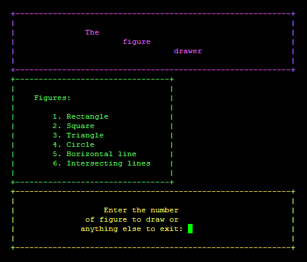
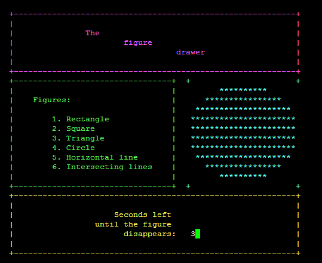

# Figures

## Configuration instructions

### Required equipment:
	
1. [Raspberry Pi](https://en.wikipedia.org/wiki/Raspberry_Pi), 
	Model 3B ( further: [RPi](https://en.wikipedia.org/wiki/Raspberry_Pi) )

2. ["RJ45" Ethernet cable](https://en.wikipedia.org/wiki/Modular_connector#8P8C) 
	( further: [e-cable](https://en.wikipedia.org/wiki/Modular_connector#8P8C) )

3. Power supply for the [RPi](https://en.wikipedia.org/wiki/Raspberry_Pi) 
	( one of the following ):
	- USB cable + seperate device's USB port ( PC, laptop, etc. )
	- [Common external power supply](https://en.wikipedia.org/wiki/Common_external_power_supply)

4. Main operating computer ( PC, laptop, etc.; further: MOC )

### Required equipment set-up:

1. Connect the [RPi](https://en.wikipedia.org/wiki/Raspberry_Pi) to the 
	Internet using the [e-cable](https://en.wikipedia.org/wiki/Modular_connector#8P8C)

2. Connect the [RPi](https://en.wikipedia.org/wiki/Raspberry_Pi) to the power supply

## Installation instructions

### Required software:
	
1. [RPi](https://en.wikipedia.org/wiki/Raspberry_Pi) files ( 
	[RPi](https://en.wikipedia.org/wiki/Raspberry_Pi) )

2. [PuTTY](https://en.wikipedia.org/wiki/PuTTY) ( 
	[MOC](https://github.com/roman-bezusiak/Sound-proj.#required-hardware) )

### Optional software changes

All the customization of the drawing area ( FIG_AREA ) can be done in the _output.h_ 
	file. THe file's description is self-explanatory. Customization of other fields 
	can be done in the _display.c_ file.

## Operating instructions

1. Launch the [RPi](https://en.wikipedia.org/wiki/Raspberry_Pi)

2. Connect to the [RPi](https://en.wikipedia.org/wiki/Raspberry_Pi) via 
	[PuTTY](https://en.wikipedia.org/wiki/PuTTY)

3. Make the object files and the _sound.a_ application by running 
	the following command:

```
~$ make
```

4. Run the application by entering the following command:

```
~$ ./figures.a
```

5. Enter the number of the figure to be drawn



6. The program will be showing the figure during some period of time and then it will 
	go back to the initial state, asking for further instructions. The period of time depends on the **RES_DELAY** constant value ( default: 3 seconds ) in the 
	_output.h_ file.



7. To quit the program, enter anything except numbers defined by constants in the 
_output.h_ file:
	- **RECTANGLE** ( default: 1 )
	- **SQUARE**    ( default: 2 )
	- **TRIANGLE**  ( default: 3 )
	- **CIRCLE**    ( default: 4 )
	- **HLINE**     ( default: 5 )
	- **XLINES**    ( default: 6 )

## File manifest

### List:

- [RPi](https://en.wikipedia.org/wiki/Raspberry_Pi) ( **_5_** ):
	- **_.c_ files** ( **_3_** ):
		- display.c
		- main.c
		- makeFigure.c
	- **_.h_ files** ( **_1_** ):
		- comm.h
	- **_Other_ files** ( **_1_** ):
		- makefile

- Other ( **_4_** ):
	- README.md
	- LICENCE
	- TUI_active_state.png
	- TUI_initial_state.png

#### Total: **_9_** files

## Copyright and licensing information

This project is licensed under the 
[**GNU General Public License**](https://en.wikipedia.org/wiki/GNU_General_Public_License). 
See the [_LICENSE_](LICENSE) file for details

## Credits and acknowledgments

### Authors:
- **Roman Bezusiak** - _Initial work_ - 
	[github.com](https://github.com/roman-bezusiak)

### Used resources:
- **[Wikimedia Foundation Inc.](https://wikimediafoundation.org/wiki/Home), 
	Wikipedia** - _Encyclopedia materials_ - 
	[wikipedia.org](https://www.wikipedia.org/)
